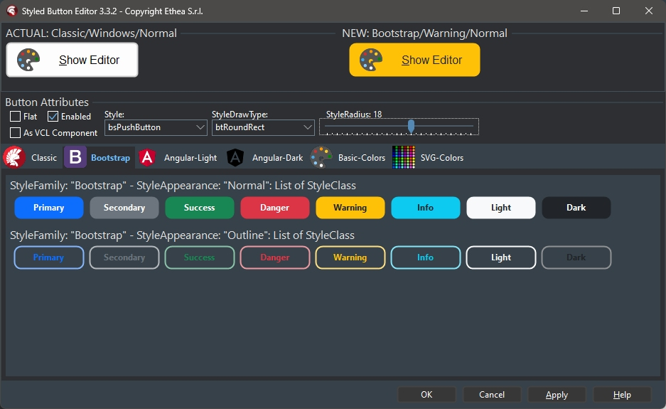
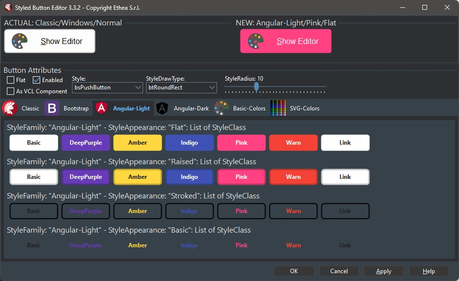
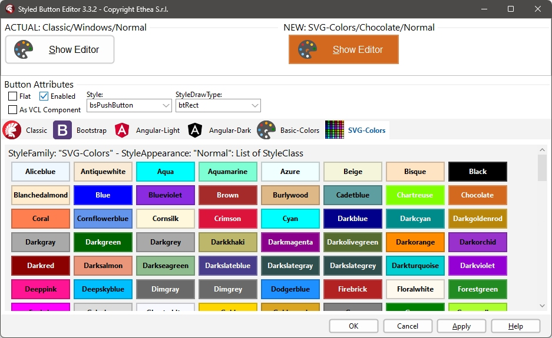
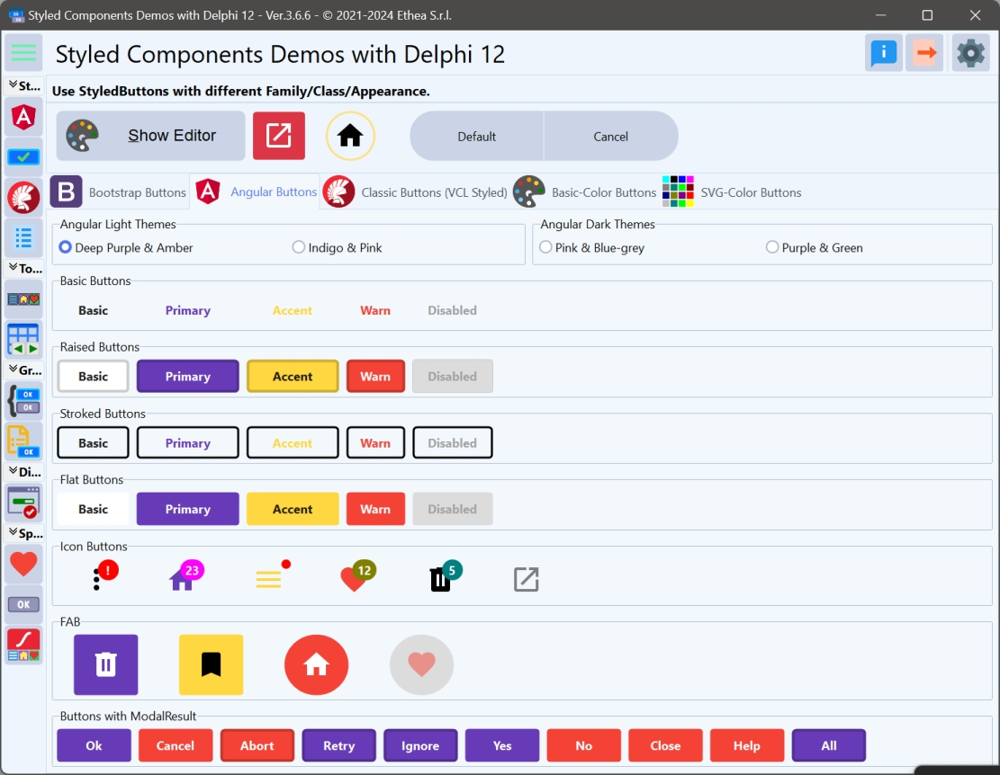
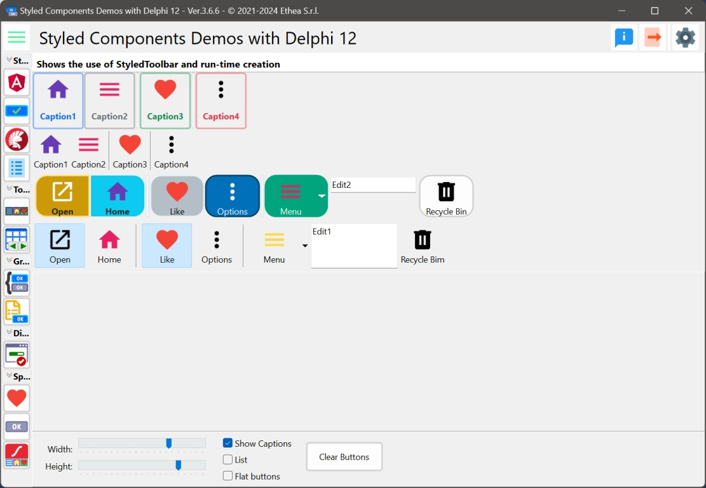
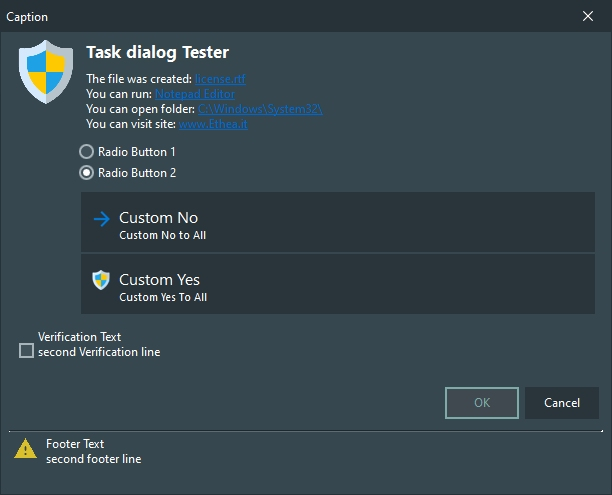
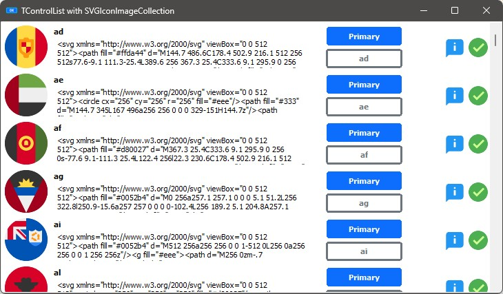
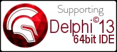

# Delphi StyledComponents 

## Delphi VCL Buttons and Toolbar with Custom Graphic Styles, and an advanced, full-customizable TaskDialog, also with animations!

### Actual official version: 2.0.0

| Component | Description |
| - | - |
|  | **TStyledGraphicButton** is a "pure" Graphic Button with Styles (eg. Classic, Bootstrap, Angular, Basic-Color, SVG-Color) with support of ImageList, Action and full configuration of five states: Normal, Hot, Focused, Down and Disabled. You can use it also into a TVirtualList component.|
|  | **TStyledButton** inherits from TStyledGraphicButton and add support for focus and TabStop to the button.|
|  | **TStyledToolbar** is a Toolbar that uses StyledToolButton, with full customizable of every button style and full control over the size of the buttons, also when Captions are visible.|
|  | **TStyledTaskDialog** is a special "TaskDialog" component with custom Button Captions and Icons. Using a special Form you can show a full customizable Dialog. Using Skia4Delpghi you can show animated dialogs!|

---

## Installation of Packages for Delphi (from XE6 to 11) ##

Open the package group Vcl.StyledComponents.groupproj from the correct folder of your Delphi version (eg. \StyledComponents\Packages\D11), then build the run-time package: StyledComponentsDXX and install the design-time package: dclStyledComponentsDXX. Add the "StyledComponents\source" path to use the components in your application.

*if you need package for other Delphi version not included (newer than XE6) please add a new [Issue](https://github.com/EtheaDev/StyledComponents/issues)*

## Description of Styled Buttons ##

**TStyledGraphicButton**, **TStyledButton** are designed to expand Button UI styles to break the limits of classic TButton and TBitBtn provided in Delphi.

The Button Styles defined are not affected by VCLStyles and are also visibile on a "non styled" Windows application, so you can have more than a single Button styled also using VCLStyles. You can build rectangular or rounded or ellipsis/circle button as you prefer.

using only three elements you can setup your Button in a very simple way:

**Component editor for TStyledGraphicButton and StyledButton:**

To simplify use of the Styled Buttons, there is a useful "Component Editor" to select three values that defines Button Style:

- **StyleFamily**: the main attribute for Styled Button
- **StyleClass**: a collection of predefined button style
- **Style Appearance**: eg.Normal or Outline

***List of available StyleFamily***
- **Classic**: a collection of Styles similar to [VCLStyled TButton](https://docwiki.embarcadero.com/RADStudio/Alexandria/en/Tutorial:_Using_TControl.StyleElements_in_VCL_Applications)
- **Bootstrap**: a collection of Styles similar to [Bootstrap buttons](https://getbootstrap.com/docs/4.0/components/buttons/)
- **Angular-Light**: a collection of styles similar to [Angular buttons](https://material.angular.io/components/button/overview)
- **Angular-Dark**: a collection of styles similar to [Angular buttons](https://material.angular.io/components/button/overview)
- **Basic-Color**: a collection of styles based to Delphi "normal" and "System" [Color collection](https://docwiki.embarcadero.com/RADStudio/Alexandria/en/Color_Constants)
- **SVG-Color**: a collection of styles based to Delphi "AlphaColors" [Color collection](https://johndecember.com/html/spec/colorsvghex.html)

*In this picture the Component Editor to select "Boostrap" styles: Style Appearance are Normal and Outline*

*In this picture, the Component Editor to select "AngularUI" styles: Style Appearance are Flat, Raised, Basic, Stroked*

*In this picture, the Component Editor to select "Classic" styles: Style Appearance are Normal and Outline*

*In this picture, the Component Editor to select "SVG-Color" styles: Style Appearance are Normal and Outline*

**Look at the Demo Folder:**

**Demos\Delphi10_3+\StyledButtonsDemo**

A simple demo to show the use of Buttons in many different ways...

In the demo you can test many different ways to obtain Styled Button, Icon, FAB...

---
## Description of StyledToolBar ##

TStyledToolbar is designed to use TStyledToolButtons inside, to show a Toolbar like a classic TToolbar but with the same Style attributes that can be assigned to Styled Graphic Buttons.

In the StyledToolbar demo, you can see how to use this component, compared to the classic Delphi TToolBar.

*In this picture, the Toolbar Demo compares the StyledToolbar and the classic Toolbar*

The major differece is based on the control of the "size" of buttons when "ShowCaptions" is True: in standard Toolbar, the dimension is defined by the larger caption.
In the StyledToolbar the dimension is always defined by "ButtonWidth" property.

---

## Description of StyledTaskDialog ##

**TStyledTaskDialog** is designed to expand message/task dialog functionalities, fully customizable and also animation.

You can test Styled Dialogs with different "StyledButton set" (Classic, Angular, Bootstrap).

Also, you can use a custom form (inherited from "TStyledTaskDialogForm") to show your complete custom Dialog.

**Demos\StyledTaskDlgDemo and Demos\AnimatedTaskDialogDemo**

A simple demo to show how to use StyledTaskDialog with custom icons using ImageList.

The main form is useful to test every format / buttons and type of dialogs.

*Confirmation Dialog with custom font and English buttons*

*Warning Dialog with italians Buttons*

A simple way to activate button captions is to change StyledComponents.inc file and activate {$Define ItaMessages}

*Error Dialog*

*Custom Dialog*

*Shield Dialog with footer*

## Description of AnimatedStyledTaskDialog ##

If you have Skia4Delphi, you can also try the AnimatedTaskDialogDemo, with nice animations:

**Demos\Delphi10_4+\StyledButtonInControlList**

A simple demo to show how to use StyledGraphicButton into a ControlList (only for D10.4+)

### Available from Delphi XE6 to Delphi 11 (32bit and 64bit platforms)

Related links: [embarcadero.com](https://www.embarcadero.com) - [learndelphi.org](https://learndelphi.org)

### RELEASE NOTES

10 Jul 2023: version 2.0.0
- Added two StyleFamily options: "Basic-Color" and "SVG-Color"
- Added new component: TStyledToolbar with Component-Editor
- Updated "Classic" family with full support of every VCL-Styles
- Updated "Component-Editor" and "Property-Editors"
- Added "WordWrap" property
- Added more Demos, like StyledToolbarDemo and StyledButtonsVCLStyled

23 Nov 2023: version 1.1.0
- Fixed AnimatedStyledDialog Demo
- Added gif to show AnimatedStyledDialog Demo

17 Nov 2022: version 1.0.0
- First official version
StyledButton:
- Removed FontName from Specific Style
- Added PopUpMenu
- Automatic Style changing ModalResult
- Fixed Button Border size changing DPI of screen
- Fixed Outlined Appearance of "Classic" buttons
- Demo updated to show Buttons with ModalResult
StyledDialog:
- Fixed width of Dialog changing DPI of screen
- Styles of buttons selectable by "Family"
- Fixed tabstop and focus of buttons

15 Nov 2022: version 0.9.9
StyledButton:
- Added Angular-Light and Angular-Dark Families
- Radius renamed to StyleRadius
- BorderType renamed to StyleDrawType
- Fixed MouseDown for GraphicButton
- Added CreateAndPosStyledButton global function
- Added AssignAttributes method
- Changed "Down" to "Pressed"
- Changed "Focused" to "Selected"
- Fixed ClickEffect
- Updated Demo
- Updated Component Editor to include Angular Families
StyledDialog:
- Added example of AnimatedTaskDialog using Skia4Delphi
- TStyledTaskDialogForm is the base Form class for any StyledDialog
- Added example of Lottie animations in Animations folder
- Added resources of Animation built with Resource Compiler
- Added Delphi 10.1, 10.2, 10.3 Packages

10 Nov 2022: version 0.9.8
StyledButton:
- Added DisabledImages, DisabledImageName, DisabledImageIndex, PressedImageIndex, PressedImageName, HotImageIndex, HotImageName, SelectedImageIndex, SelectedImageName.
- Used GDI+ for rendering of buttons
- Added Circle and Square Buttons styles
StyledDialog:
- Added Footer area and Text
- Added full support for component TStyledTaskDialog (eg.shield icon)
- Fixed Focused and DefaulButton
- Updated test demo

07 Nov 2022: version 0.9.5 (VCL)
- Added Styled Button properties: StyleFamily, StyleClass and StyleAppearance
- Added "Classic Family" with Styles similar to VCL Styles
- Updated "Bootstrap Family"
- Added Component Editor for Styled Button
- Fixed Dialog Form: focused buttons, all dialog buttons available
- Fixed Styled Button

03 Nov 2022: version 0.9.1 (VCL)
- Added TStyledGraphicButton

01 Nov 2022: version 0.9.0 (VCL)
- First "beta" version

Thanks to Paulo Alvis "PraButtonStyle component" for the inspiration of my StyledButton.