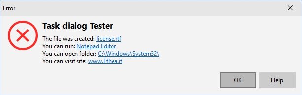

# Delphi StyledComponents 

## Delphi VCL Components (Button and TaskDialog) with Custom Graphic Styles

### Actual official "beta" version: 0.9.0

| Component | Description |
| - | - |
|  | **TStyledButton** is a Graphic Button with Styles (eg. Bootstrap) with support of ImageList, Action and full configuration of five states: Normal, Hot, Focused, Down and Disabled|
|  | **TStyledTaskDialog** is a special "TaskDialog" component with custom Button Captions and Icons. Using a special Form you can show a full customizable Dialog |

## Additional Components Required ##

**TStyledButton** and **TStyledTaskDialog** Demo uses SVGIconImageList components, but you can use another Image/Icon support.

## Description ##

**TStyledButton** and **TStyledTaskDialog** are designed to expand Button and Dialogs functionalities.

**Look at the Demo Folder:**

Notice: to build Demos you must first Download [SvgIconImageList Components](https://github.com/EtheaDev/SVGIconImageList)

**Demos\StyledButtonsDemo**

A simple demo to show different "Styled Class" Buttons (similar to Bootstrap buttons) and outlined versions.

**Demos\StyledTaskDlgDemo**

A simple demo to show how to use StyledTaskDialog with custom icons, caption for buttons, etc.

Activating "Use Styled Dialog" you can use a special form to show complete custom Dialog, like in those pictures:

*Warning Dialog*

*Error Dialog*

*Custom Dialog*

### Available from Delphi XE6 to Delphi 11 (32bit and 64bit platforms)

Related links: [embarcadero.com](https://www.embarcadero.com) - [learndelphi.org](https://learndelphi.org)

### RELEASE NOTES

01 Nov 2022: version 0.9.0 (VCL)
- First "beta" version

Thanks to Paulo Alvis PraButtonStyle component for the inspiration of StyledButton.
