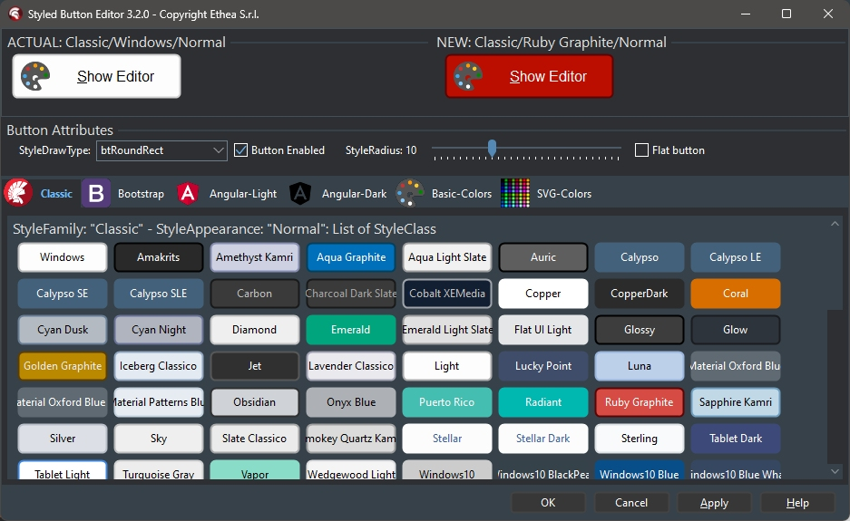
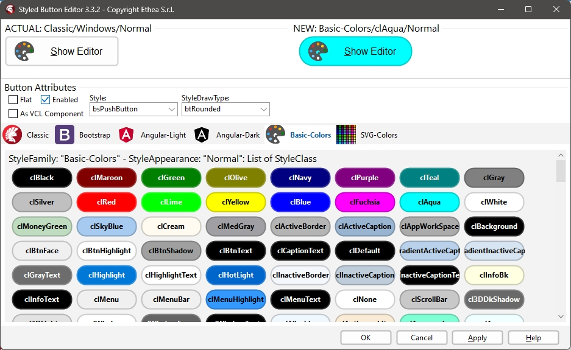
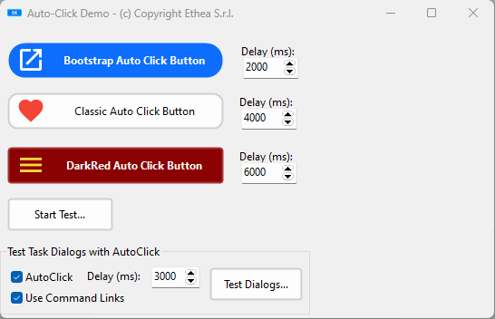
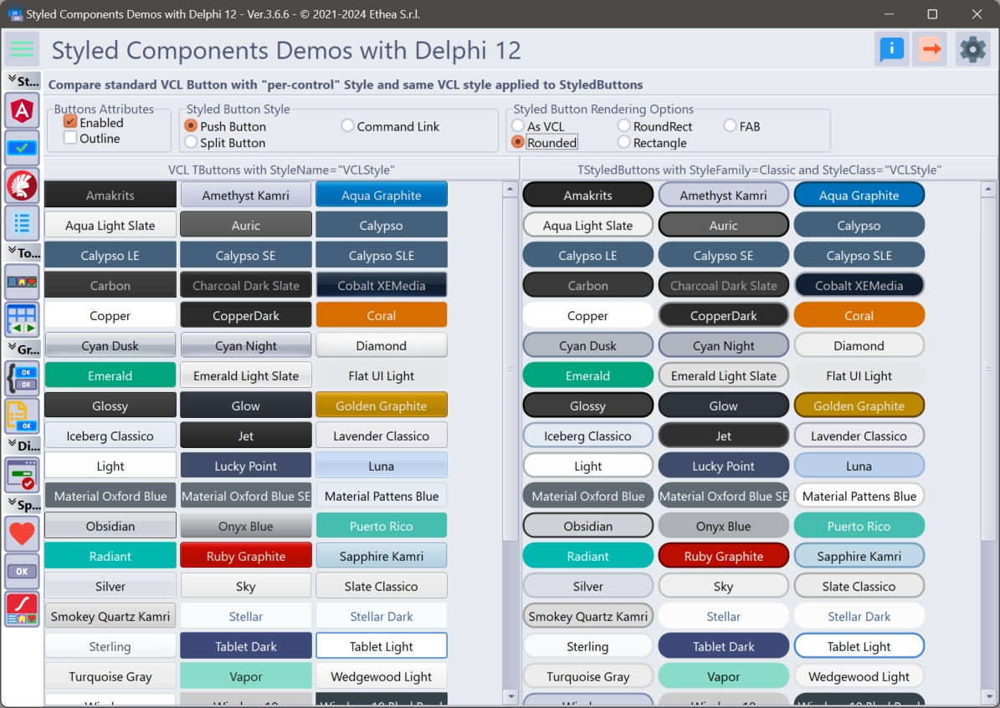
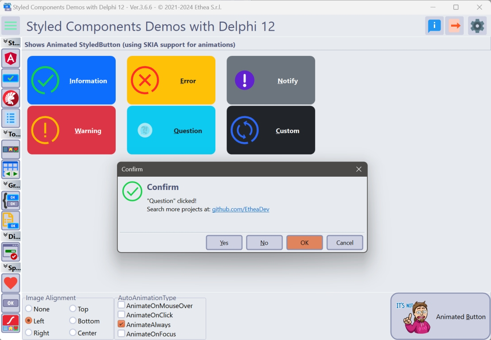
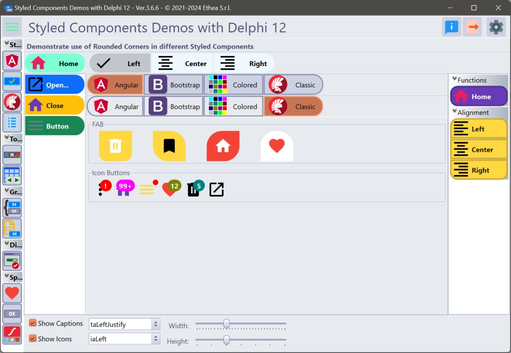
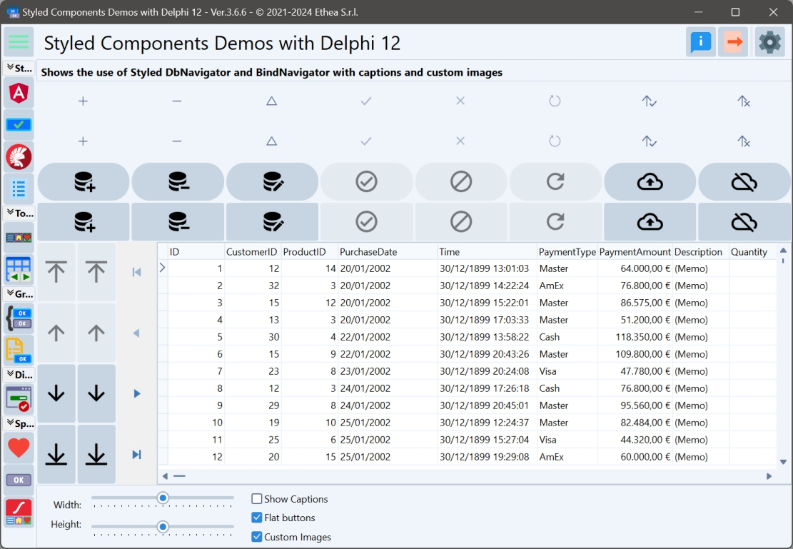
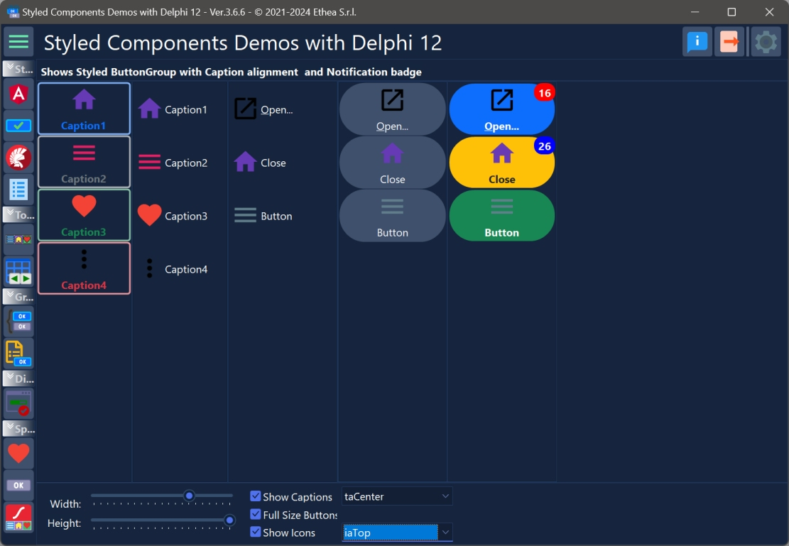
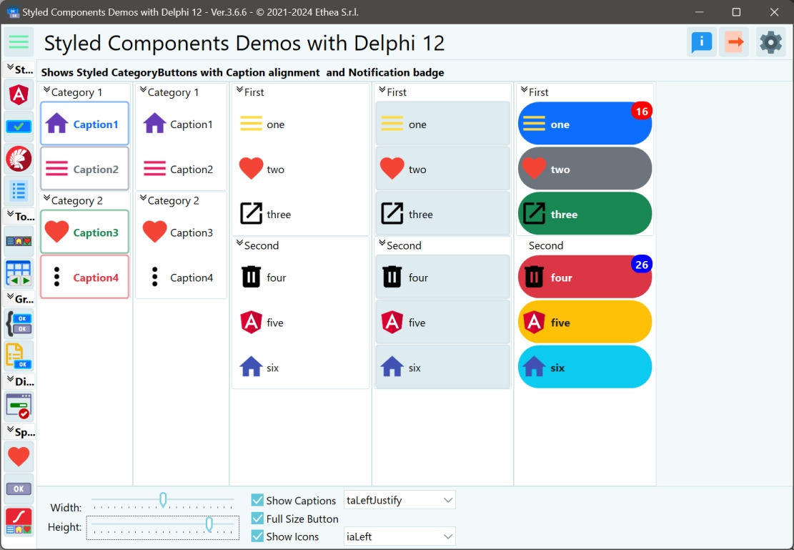
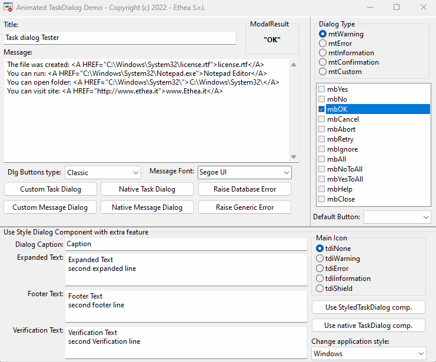

# Delphi VCL StyledComponents [](https://opensource.org/licenses/Apache-2.0)

## Components similar to Delphi VCL Buttons, Toolbar, DbNavigator, BindNavigator, ButtonGroup and CategoryButtons with Custom Graphic Styles, and an advanced, full-customizable TaskDialog, also with animations!

### Actual official version: 3.8.1

---
## New Setup for Installation of Components

From 3.8.1 version a new "Installer" read-to-use is located in the Release area: [Download the Installer](https://github.com/EtheaDev/StyledComponents/releases/latest/download/StyledComponents_Setup.exe).

The Installer automatically detect your Delphi versions, installa sources, build and installa packages and add source paths.


---
## A brief description

**StyledComponents** is a set of VCL components for Delphi (32 and 64 bit) that allow you to overcome the limits imposed by standard VCL components, maintaining 100% compatibility of the properties.

You can easily use them, as a replacement for the standard ones, as well as to provide new features.

The main limitations of the buttons and components of the VCL are the shape and color, defined by the operating system.

With **StyledComponents** you can overcome these limits in a simple way. You can:
- Control the shape of the button
- Control button and border color (without limits) for every button state.
- Use "families" of predefined styles as in the WEB environment (e.g. Angular or Bootstrap)
- Adapt to the colors of the VCL styles, keeping the shape of the button consistent
- The appearance is identical in “Windows” mode or by applying VCL styles to the application

Last, but not least, with **StyledTaskDialog** you can control appearance of your Message Dialogs in any aspect. Using Skia4Delphi you can also add animated Icons to your messages.

…all available from the Delphi XE6 version (which allows the use of GDI+, used for button drawing).

## The most important properties

using only few properties you can setup your Button in a very simple way.

### Color attributes:
With three values, you can select predefined ready styles for button color, border and font color:
- **StyleFamily**: the "Family" of a Style (eg.Classic or Bootstrap or Angular)
- **StyleClass**: a collection of predefined button style of the selected Family
- **Style Appearance**: eg.Normal or Outline

### Shape attributes:
- **StyleDrawType**

|`btRoundRect (default)`|`btRect`|`btRounded`|`btEllipse`|
| :-- | :-- | :-- | :-- |
|||||

- **StyleRoundedCorners**: used for RoundRect and Rounded DrawType
- **StyleRadius**: used for btRoundRect DrawType

_In this picture you can see the StyledComponentsDemo application with some examples:_


### Special Properties:
StyledComponents offers more options then standard components, such as:

- Down, AllowUp and GroupIndex to use them in "group"
- Caption alignment (left, centered, right)
- Presence of Captions (with alignment) and customizable icons via ImageList in TStyledDBNavigator and TStyledBindNavigator
- Ability to change icon position and caption alignment in TStyledButtonGroup and TStyledCategoryButtons
- Different appearance for buttons Items of TStyledToolbar, TStyledButtonGroup and TStyledCategoryButtons
- Notification Badge for all StyledButtons
- AutoClick event (after a Delayed time)
- Animated icons using, TStyledAnimatedButton

…finally, a component for Dialogs is available, completely customizable, which uses custom images or animations and StyledButtons within it, to be 100% consistent with the rest of the application.

Notice: by default the cursor for all Styled Buttons is crHandPoint.

## List of available Components:
| Component | Description |
| - | - |
|  | **TStyledGraphicButton** is a "pure" Graphic Button with Styles (eg. Classic, Bootstrap, Angular, Basic-Color, SVG-Color) with support of ImageList, Action and full configuration of five states: Normal, Pressed, Selected, Hot and Disabled. You can use it also into a TVirtualList component.|
|  | **TStyledButton** is classic "button control" with Styles (eg. Classic, Bootstrap, Angular, Basic-Color, SVG-Color) with support of ImageList, Action and full configuration of five states: Normal, Pressed, Selected, Hot and Disabled, plus Focus and TabStop support. You can easily replace all of your TButton components.|
|  | **TStyledToolbar** is a Toolbar that uses StyledToolButton, with full customizable of every button style and full control over the size of the buttons, also when Captions are visible. The width and height of the StyledToolButtons inside, do not depends on Caption size, as in classic TToolBar.|
|  | **TStyledDbNavigator** is a special "DbNavigator" component, with Styles (eg. Classic, Bootstrap, Angular, Basic-Color, SVG-Color), plus Button captions and better "move" icons in vertical mode. |
|  | **TStyledBindNavigator** is a special "BindNavigator" component, with Styles (eg. Classic, Bootstrap, Angular, Basic-Color, SVG-Color), plus Button captions and better "move" icons in vertical mode. |
|  | **TStyledButtonGroup** is a special "ButtonGroup" component with Styles (eg. Classic, Bootstrap, Angular, Basic-Color, SVG-Color) plus ImagePosition, CaptionAlignment and Flat properties, for adding more controls to the appearance of Buttons.|
|  | **TStyledCategoryButtons** is a special "CategoryButtons" component with Styles (eg. Classic, Bootstrap, Angular, Basic-Color, SVG-Color) plus ImagePosition, CaptionAlignment and Flat properties, for adding more controls to the appearance of Buttons.|
|  | **TStyledTaskDialog** is a special "TaskDialog" component (to replace MessageDlg and TaskDlg) with custom Button Captions and Icons. Using a special Form you can show a full customizable Dialog. Using Skia4Delpghi you can show animated dialogs!|

---

For "backward compatibily", you can also use those components.

| Component | Description |
| - | - |
|  | **TStyledSpeedButton** derives from TStyledGraphicButton, and introduce _Layout_, _Margin_ and _Spacing_ properties, to control Drawing (Icon and Caption) as a standard TSpeedButton. You can also use Glyph and NumGlyphs.|
|  | **TStyledBitBtn** derives from TStyledButton, and introduce _Layout_, _Margin_ and _Spacing_ properties, to control Drawing (Icon and Caption) as a standard TBitBtn. You can also use Glyph and NumGlyphs.|

Those components uses some properties to Draw Icon and Caption in a different way:
- A _Glyph_ and _NumGlyphs_ for the Icon of the button (not reccomended, because doesn't scale)
- The position of the caption, using _ButtonLayout_ instead and _Margin_ (instead of _ImageAlignment_ and _ImageMargins_)
- The space between the Icon and the Caption, defined by _spacing_.

---

## _TStyledAnimatedButton_ Component (using Skia4Delphi):
| Component | Description |
| - | - |
|  | **TStyledAnimatedButton** is Styled Button with with "animated icon" using a Skia TSkAnimatedImage component inside. You can select the events that starts the animation, like: _AnimateOnMouseOver_, _AnimateOnClick_, _AnimateAlways_, _AnimateOnFocus_. |

---

## Installation ##

### Installation of Packages for Delphi/VCL (from XE6 to Delphi 12) ###

Open the package group **Vcl.StyledComponents.groupproj** from the correct folder of your Delphi version (eg. \StyledComponents\Packages\D12).

Then build the run-time package: **StyledComponentsXXX** and install the design-time package: **dclStyledComponentsXXX**.

Remember to add the **"{Folder}\StyledComponents\source"** path to use the components in your application or the library path **"{Folder}\StyledComponents\Lib\DXX\WinXX\Release"**

### Installation of Animated Components for Delphi/VCL (from XE7 to Delphi 12) ###

If you want to use also the Animated Components, you need Skia4Delphi previously installed in your IDE (In Delphi 12 it's already installed).

Open the package group **Vcl.StyledAnimatedComponents.groupproj** from the correct folder of your Delphi version (eg. \StyledComponents\Packages\D12).

Then build the run-time package: **StyledAnimatedComponentsXXX** and install the design-time package: **dclStyledAnimatedComponentsXXX**.

*if you need package for other Delphi version not included (newer than XE6) please add a new [Issue](https://github.com/EtheaDev/StyledComponents/issues)*

## Description of Styled Buttons ##

**TStyledGraphicButton**, **TStyledButton**, **TStyledBitBtn** and **TStyledSpeedButton** are designed to expand Button UI styles to break the limits of classic VCL Button components.

The Button Styles defined are not affected by VCLStyles and are also visibile on a "non styled" Windows application, so you can have more than a single Button styled also using VCLStyles.

You can build Rectangular, Rounded or RoundRect or Ellipsis/Circle button as you prefer.

using only three elements you can setup your Button in a very simple way:

- **StyleFamily**: the main attribute for Styled Button
- **StyleClass**: a collection of predefined button style
- **Style Appearance**: eg.Normal or Outline

**Component editor for TStyledGraphicButton and StyledButton:**

To simplify use of the Styled Buttons, there is a useful "Component Editor" to select three values that defines Button Style:

***List of available StyleFamily***
- **Classic**: a collection of Styles similar to [VCLStyled TButton](https://docwiki.embarcadero.com/RADStudio/Athens/en/Tutorial:_Using_TControl.StyleElements_in_VCL_Applications)
- **Bootstrap**: a collection of Styles similar to [Bootstrap buttons](https://getbootstrap.com/docs/4.0/components/buttons/)
- **Angular-Light**: a collection of styles similar to [Angular buttons](https://material.angular.io/components/button/overview)
- **Angular-Dark**: a collection of styles similar to [Angular buttons](https://material.angular.io/components/button/overview)
- **Basic-Color**: a collection of styles based to Delphi "normal" and "System" [Color collection](https://docwiki.embarcadero.com/RADStudio/Alexandria/en/Color_Constants)
- **SVG-Color**: a collection of styles based to Delphi "AlphaColors" [Color collection](https://johndecember.com/html/spec/colorsvghex.html)

***Control the default rendering styles for any Styled Buttons, Toolbars and DbNavigator***

It's possible to redefine at global application level the default Drawing styles for any Components, adding some line in your project file. For Example:

Add those units in uses of dpr:
```Pascal
  Vcl.StyledButton,
  Vcl.ButtonStylesAttributes,
  Vcl.StyledDbNavigator,
  Vcl.StyledToolbar,
```
Add those lines after Application.Initialize in dpr code:
```Pascal
  TStyledButton.RegisterDefaultRenderingStyle(btRounded);
  TStyledDbNavigator.RegisterDefaultRenderingStyle(btRounded);
  TStyledToolbar.RegisterDefaultRenderingStyle(btRect);
```
You can also use a Family/Class/Appearance of any type, for example:

```Pascal
TStyledButton.RegisterDefaultRenderingStyle(btRoundRect, BOOTSTRAP_FAMILY, btn_primary, BOOTSTRAP_NORMAL);
```
You can also use [Interposer Unit (Vcl.StyledComponentsHooks.pas)](https://github.com/EtheaDev/StyledComponents/wiki/Interposer-Unit-(Vcl.StyledComponentsHooks)) to easily change all Buttons of your application.

***Template unit to create your custom Family Styles***

With the unit "Vcl.TemplateButtonStyles.pas" you can create your own Family of Button Styles, [as explained here](https://github.com/EtheaDev/StyledComponents/wiki/HowtoBuildYourCustomStyle)

---
---
*The Component Editor, with selected Family "Boostrap" and StyleRadius 18: Style Appearance can be Normal or Outline*


---
*The Component Editor, with selected Family "Angular Light": Style Appearance can be Flat, Raised, Basic, Stroked*


---
*The Component Editor, with selected Family "Classic": Style Appearance can be Normal or Outline*


---
*The Component Editor, with selected Family "Basic-Colors", and Rounded StyleDrawType: Style Appearance can be Normal and Outline*


---
*The Component Editor, with selected Family "SVG-Color", Style Appearance can be Normal or Outline*


---
**Special Features**

Styled Components has special features compared to classic VCL Controls.

***RoundedCorners options***

You can define **RoundedCorners** property, to enable/disable Rounding drawing, as showed in this example:


***Notification Badge for buttons***

All styled Buttons can show **NotificationBadge** above them, with custom label/color and shape.


Read [Notification Badge guide](https://github.com/EtheaDev/StyledComponents/wiki/Notification-Badge-guide) to explorer how it works...

***AutoClick/AutoClickDelay for buttons***

You can activate the _AutoClick_ flag to invoke the Click event of the StyledButton, after a _AutoClickDelay_ time, as showed in the AutoClick Demo:

Also the StyledTaskdialog can use this function to AutoClick and close the Dialog.



Read [AutoClick/Delay guide](https://github.com/EtheaDev/StyledComponents/wiki/AutoClick-Delay-guide) to explorer how it works...

***Rounded Button Style***

_In this picture an example of "full-rounded" buttons applyed to all "VCL-Styled" buttons: a feature not available in VCL Styled buttons.


---

**Use the "StyledComponentsDemos" to see all the components in action!**

In the Demos folder you can find subfolders for every Delphi version that contains the project:

_StyledComponentsDemo.dproj_

The demo is organized to launch different Forms "embedded" into the main form client area or outside.

**Demos\StyledButtonsDemo\Delphi10_4+\StyledButtonsVCLStyled.dpr**

Using standard VCL Buttons you can apply different colors only from Delphi 10.4, using "per-control" option, but you cannot control other aspect of Buttons.

With StyledComponents you can have Buttons with the active VCL-Style also in previous versions of Delphi, and you can control all the aspect of the button, like Rounded shape, as you can test in the Demo.

The same demo, compiled with an old Delphi version (like XE6) show that you have this feature available!



**Enabling Skia4Delphi to see the Animated Buttons Demo in action**

If you have Skia4Delphi installed, you must install also the Packages contained into Vcl.StyledAnimatedComponents.groupproj.

Then you must "Enable SKIA" in the "context-menu" of StyledComponentsDemo project, so you can see the StyledAnimated Buttons in action.



_Notice that this feature is not available in Delphi XE6._


**RoundedCorners Demo**

A simple way to show StyledRoundedCorners options applied to many Styled Components.



---

## Description of StyledToolBar ##

TStyledToolbar (and TStyledToolButtons) shows a Toolbar like a classic TToolbar but with the same Style attributes that can be assigned to Styled Graphic Buttons.

In the StyledToolbar demo, you can see how to use this component, compared to the classic Delphi TToolBar.

The major differece is based on the control of the "size" of buttons when "ShowCaptions" is True: in standard Toolbar, the dimension is defined by the larger caption.
In the StyledToolbar the dimension is always defined by "ButtonWidth" property.


*In this picture, the Toolbar Demo compares the StyledToolbar and the classic Toolbar*


---

## Description of StyledDbNavigator and StyledBindNavigator ##

TStyledDbNavigator (with TStyledNavButton buttons) shows a Navigator like a classic TDbNavigator but with the same Style attributes that can be assigned to Styled Graphic Buttons.

TStyledBindNavigator (with TStyledNavButton buttons) shows a Navigator like a classic TBindNavigator but with the same Style attributes that can be assigned to Styled Graphic Buttons.

In the TStyledDbNavigator demo, you can see how to use those components, compared to the classic Delphi TDbNavigator and TBindNavigator.

*In this picture, the StyledDbNavigator and StyledBindNavigator with a custom imagelist for images and Captions visible*



The major differences are:
- the possibility to set and show Captions on the StyledDbNavigator.
- The "Icons" with up/down directions when the navigator is displayed in vertical position.
- The icons are more readable (like the "Edit" one) and customized form VCL Styled in light and dark mode.
- It's possible to use a Custom Imagelist, to show other images on the buttons.

---

## Description of StyledButtonGroup and StyledCategoryButtons ##

TStyledButtonGroup and TStyledCategoryButtons shows a list of buttons with flow or full-size layout, like a classic TButtonGroup or TCategoryButtons.
You can define StylesFamily/StyleClass/StyleAppearance for every buttons at component level or change the Style on a single "Button" Item.

TStyledButtonGroup inherits from TButtonGroup, so you can continue to use it as the VCL component as showed in the Demo:



TStyledCategoryButtons inherits from TCategoryButtons, so you can continue to use it as the VCL component  as showed in the Demo:



The major differences are:
- You can define a custom style for every buttons in the "Group" or "Categories"
- You can use a custom style for each button.
- You can specify Flat buttons.
- The Buttons caption can be aligned also at center or right.
- The Buttons icons can be aligned left, top, bottom, right, center.
- Additional Spacing and ImageMargins to control exact position of the Buttons icon and the Caption.

---

## Description of StyledTaskDialog ##

**TStyledTaskDialog** is designed to expand message/task dialog functionalities, fully customizable and also animation.

You can test Styled Dialogs with different "StyledButton set" (Classic, Angular, Bootstrap).

Also, you can use a custom form (inherited from "TStyledTaskDialogForm") to show your complete custom Dialog.

## How to replace standard MessageDlg and TaskDialogs ##

You can use the StyledTaskDialog in you application to replace MessageDlg and and TaskDialogs.

Add the unit **Vcl.StyledTaskDialogFormUnit.pas** your application.

If you are using Skia4Delphi and you want to use Animated Dialogs, add the unit **Skia.Vcl.StyledTaskDialogAnimatedUnit.pas**

then you must add the unit **Vcl.StyledTaskDialog** to your units and change the calls to standard Dialogs/TaskDialogs:
MessageDlg -> StyledMessageDlg
TaskDialog -> StyledTaskDialog

## How to change Dialogs attributes (Font/Buttons Style) ##

By default, StyledDialogs uses Segoe UI Font with Size 9 (stored into Vcl.StyledTaskDialogFormUnit.dfm). If you want to use another font/size you can call InitializeStyledTaskDialogs like in this example:

```Delphi
  //Resize Standard Message Font to an higher size and select Arial character
  Screen.MessageFont.Size := Round(Screen.MessageFont.Size*1.2);
  Screen.MessageFont.Name := 'Arial';
  //Inizialize the styled dialogs using "Bootstrap" styled buttons and the Screen.MessageFont
  InitializeStyledTaskDialogs(True, Screen.MessageFont, BOOTSTRAP_FAMILY);
```

**StyledTaskDialog Demo**

A simple demo to show how to use StyledTaskDialog with custom icons using ImageList.

The main form is useful to test every format / buttons and type of dialogs.

++*Confirmation Dialog with custom font/size and English buttons*++


++*Warning Dialog with italians Captions in AcquaGraphite Style*++

To activate button captions is to change StyledComponents.inc file and activate {$Define ItaMessages}


++*Error Dialog in Windows10 Vcl Style*++


++*Custom Message Dialog*++


++*Use StyleTaskDialog component*++

*...with RadioButtons, CommandLinks, Verification Text and Footer Text*


## Demo of AnimatedStyledTaskDialog ##

If you are have Skia4Delphi installed, you can also try the AnimatedTaskDialogDemo, with nice animations:



### Available from Delphi XE6 to Delphi 12 (32bit and 64bit platforms)


Related links: [embarcadero.com](https://www.embarcadero.com) - [learndelphi.org](https://learndelphi.org)

### RELEASE NOTES
12 Mar 2025 - Version 3.8.1
- Added support for Delphi 12 64bit IDE
- Fix storing default ImageMargins of StyledButtons

18 Jan 2025: version 3.8.0
- Added example of Custom TaskDialog Form in Demo (for Delphi 12)
- Fixed Clear Animation Data for Animated StyledButton
- Fixed Enabled of TStyledToolButton
- Changed PackageGrooup File Names
- Updated Copyright 2025

30 Nov 2024: version 3.7.5
- Added property HideSystemCloseButton to TStyledTaskDialog
- Added property OnDialogShow
- Fixed wordwrap for StyledBitBtn

10 Nov 2024: version 3.7.4
- Added tdiQuestion value to show a Question mark in TaskDialog
- Use Question Mark (icon ora animation) for MessageDlg and TaskDialog of mtConfirmation type
- Fixed Icon Size of Dialogs based on ScaleFactor
- Fixed DefaultButton for StyledDialog using MessageDlg and TaskDialog

08 Nov 2024: version 3.7.3
- Fixed Animated TaskDialog Form

08 Nov 2024: version 3.7.2
- Added UseAnimations in StyledTaskDialog component
- Fixed use of StyledTaskDialog component
- Fixed use of ModalResult value different from standard values

22 Oct 2024: version 3.7.1
- Fixed background for icon into MessageDialogs
- Fixed drawing TStyledGraphicButton

20 Oct 2024: version 3.7.0
- Outlined Colored Button (standard and SVG) now paint buttons also when focused, same as when "hot"
- Use always DrawRectWithGDIPlus
- Added AnimateOnType prop for TAnimatedButton: (AnimateOnButton, AnimateOnImage)
- Fixed transparent background for StyledButton using DoubleBuffered

12 Oct 2024: version 3.6.9
- Added Expanded button and Panel in StyledTaskDialog Form
- Changed Panel Order in StyledTaskDialog
- Added OnEnableNavBtn event in StyledDbNavigator and StyledBindNavigator
- Fixed Cursor in StyledDbNavButton when disabled
- Fixed "Resource BUTTON_SHIELD_ADMIN not found" in StyledTaskDialog
- Fixed Autoclick using StyledMessageDlg and StyledTaskMessageDlg
- Fixed Caption position

08 Oct 2024: version 3.6.8
- Fixed rendering Buttons as CommandLink

06 Oct 2024: version 3.6.7
- Fixed StyledAnimatedComponents Packages
- Fixed drawing Button Caption word-wrap mode
- Fixed default "Spacing" to 0 for StyledButtons

02 Oct 2024: version 3.6.6
- Created a new demo comprehensive of all components (StyledComponentsDemo)
- Removed old single Component Demos
- Fixed "resource not found" into IDE for StyledBitBtn
- Fixed Dialogs position using multimonitor
- Fixed UseCommandLinks option
- Fixed Scalefactor for XE6
- Fixed Height of buttons in StyledCategoryButtons (before Delphi 10.4)

16 Sep 2024: version 3.6.5
- Fixed Dialog buttons with with DPI > 100%
- Added FindDialogButton to TStyledTaskDialog
- Updated packages for Delphi 12.2

26 Aug 2024: version 3.6.4
- Fixed memory leak in Vcl.ButtonStylesAttributes.pas

20 Aug 2024: version 3.6.3
- Added AutoClick and AutoClickDelay properties to StyledButton and StyledGraphicButton
- Added AutoClick and AutoClickDelay properties to StyledTaskDialog
- Added "custom" Width and Height of Buttons for Styled Message Dialogs
- Added various versions of DoStyledTaskMessageDlg(...) functions and StyledShowMessageFmt procedure
- Added EStyledAttributesException for any StyleComponent Exceptions
- Added SortBySortOrder to StyledToolbar
- Added New AutoClick/Delay Demo for new and old Delphi versions
- Updated StyledMessageDlg Demo with AutoClick/Delay and ButtonsWidth
- Fixed drawing outside button borders when border is Rounded or RoundRect
- Fixed Tag value when Casting to TComponent

03 Aug 2024: version 3.6.2
- Fixed Stack Overflow removing StyledToolButton

31 Jul 2024: version 3.6.1
- Fixed Change of Index position for StyledToolButtons
- Fixed storing Width for StyledToolButtons when IsSeparator/Divider
- Initialize StyledToolButton when Owner is a StyledToolbar

21 Jun 2024: version 3.6.0
StyledTaskDialog Changes:

- Refactoring of TaskDialog functions and flags for initialization
- Added registration of UseCommandLinks for TaskDialogMessages
- Use of CommandLinks in TaskDialog when asking confirmation operations
- Refactoring of some function names for StyledTaskDialog
- Complete update of TaskDialog and AnimatedTaskDialog Demos
- Redefined default dialog min width to 500px at 96DPI
- Added properties: DialogButtonsFamily, UseCommandLinks, UseTitleInMessageDlg, AlphaBlendValue to StylesTaskDialog component

NotificationBadge updates:

- Added NotificationBadge for StyledCategoryButtons and StyleButtonGroup
- Updated StyledButton Demos with "emulation" of NotificationBadge via Timer
- Updated demos for NotificationBadge in StyledButtonGroup and StyledCategoryButtons

Other changes:

- Added TStyledButtonItem Assign method
- Added Packages for Delphi 10
Fixes:
- Fixed some packages for build in release mode
- Fixed assigning the active component if not focused
- Fixed compilation for DXE6
- Fixed height for TaskDialog when message in very long...

11 Jun 2024: version 3.5.4
- Added full support for TStyledTaskDialog component with EventHandlers and:
1. RadioButtons
1. CommandLinks
1. Verification Text
1. Footer Text
1. Custom buttons
- Published NotificationBadge property in StyledToolButton for StyledToolbar
- Redefined size of dialog Icons/Animations, now is 64x64 (use {$DEFINE Use_Large_Dialog_Icons} to restore old value)
- Fixed reading Tag value for TStyledBitBtn and TStyledSpeedButton
- Fixed default StyleDrawType for TStyledNavButton

16 May 2024: version 3.5.3
- Added unit Vcl.TemplateButtonStyles.pas

12 May 2024: version 3.5.2
- Fixed Storing Caption of StyledToolButton

03 May 2024: version 3.5.1
- Added AlphaBlendValue for StyledTaskDialogs
- Added Assign method for StyledToolbar and StyledDbNavigator
- Added option to change default Cursor
- Updated documentation

26 Apr 2024: version 3.5.0
- Added RoundedCorners options for StyledButtons, StyledButtonGroup, StyledCategoryButtons and StyleToolButton
- Update Component Editor for RoundedCorners options
- Added RondedCorners Examples and Demo projects
- Added AllowAllUp, GroupIndex and Down property also to TStyledButton
- Fixed Drawing Caption for TStyledToolButton and TStyledNavButton
- Added Gradient... properties and DrawingStyle, to StyledToolbar for backward compatibility

23 Apr 2024: version 3.4.5
- Enabled components into IDE using 64Bit Windows Platform
- Added ShowCaption property (default true) to StyledButtons

19 Apr 2024: version 3.4.4
- Fixed StyledDbNavigator icon resize
- Added TStyledButtonCategory to interposer unit
- Added packages for Delphi XE7

13 Apr 2024: version 3.4.3
- Fixed internal VirtualImageList for StyledDbNavigator
- Fixed resize icons for StyledDbNavigator and StyledToolbar changing monitor
- Added Interposer Unit (Vcl.StyledMessagesHooks.pas) for Messages

7 Apr 2024: version 3.4.2
- New packages for Delphi 12.1
- Added support for new Delphi 12.1 Styles (Windows11 Impressive Dark/Light)
- Fixed StyledButtonGroup e StyledCategoryButtons

5 Apr 2024: version 3.4.1
- Added StyledCategoryButtons Component
- Added StyledCategoryButtons Demo
- Fixed size of sample Button in Component Editor for StyledButtonGroup

3 Apr 2024: version 3.4.0
- Added StyledButtonGroup Component
- Added StyledButtonGroup Demo
- Fixed Registration of some Components/Properties into IDE
- Fixed TStyledBitBtn.Caption Stored in dfm as TBitBtn
- Fixed ResizeButtons after loading StyledToolBar

16 Mar 2024: version 3.3.3
- Added Notification Badge into all Styled Buttons
- Fixed apply StyleDrawType in component editor

9 Mar 2024: version 3.3.2
- Added AsVCLComponent property to Buttons to simplify backward compatibility
- Component Editor redesigned
- Added component TStyledBindNavigator
- Updated Packages and Demos
- Fixed rescaling images of TStyledDBNavigator
- Fixed GropIndex of TStyledToolButton

3 Mar 2024: version 3.3.1
- New version with three new components and many improvements:
- Added a more stable version of the Animated Styled Button Component (Using Skia4Delphi)
- Added a Demo for Animated Styled Button Component
- Added Packages for Animated Styled Button Component
- Added new TStyledSpeedButton and TStyledBitBtn, with Drawing using Spacing, Margin and Layout
- More properties for TStyledButton, for 100% backward compatibili with TButton:
- 1) Added CommandLinkHint and "bsCommandLink" mode for Style property
- 2) Added ElevationRequired Flag to automatically show "administrator-shield" icon
- 3) Added StylusHotImageIndex and StylusHotImageName properties
- 4) Added Down and GroupIndex and AllowAllUp to TStyledSpeedButton
- Added "Transparent" mode for TStyledGraphicButton and TStyledSpeedButton
- Added CaptionAlignment (LeftJustify, RightJustify and Center) to control Caption position
- Added Interposer Unit (Vcl.StyledComponentsHooks.pas) to easily replace standard VCL Buttons
- Added a section in the Wiki to explain how to replace standard VCL Buttons
- Fixed and optimized DoubleBuffered mode to avoid flickering
- Fixed Parent-Background painting
- Fixed minor bugs

18 Feb 2024: version 3.2.1
- Fixed rendering icons on StyledDbNavigator
- Fixed rendering Glyph for ImageIndex <> -1
- Fixed rendering button when placed into Form designer

03 Feb 2024: version 3.2.0
- Added "full-rounded button" DrawStyle
- Changed default for StyleDrawType from btRounded to btRoundRect
- *StyleDrawType=btRounded now draw a "full-rounded button" (StyleRadius ignored)*
- *StyleDrawType=btRoundRect now draw a "button with rounded corners" (defined by StyleRadius)*
- Added RegisterDefaultRenderingStyle for all classes (to define default rendering)
- Fixed storing CustomStyles Attributes info into dfm
- Fixed redraw when Enabled changed
- Fixed SplitButton triangle for Flat buttons
- Experimental: New Animated Buttons (Using Skia4Delphi)

02 Jan 2024: version 3.1.1
- Fixed Background color for component editor in Delphi 12
- Fixed Autosize/Wrapable for TStyledToolbar

23 Oct 2023: version 3.1.0
- Fixed FlatButton when disabled
- Fixed Autosize/Wrapable for TStyledToolbar
- Fixed Background Drawing
- Fixed default registration for StyledTaskDialogStd form
- Relesed on GetIt Package Manager

08 Oct 2023: version 3.0.0
- Complete refactoring using TStyledButtonRender to Render both TStyledGraphicButton and TStyledButton
- Removed "invisible" TStyledButtonFocusControl present in 2.x version: "Focus" and "TabStop" now works as in standard VCL Button
- Storing of properties in dfm are optimized with ActionLink
- Added support for Accelerator Keys and Keyboard Shortcuts
- Added new TStyledDbNavigator component
- Addeed "Flat" support to StyledButtons, StyledToolbar
- Added Glyph support (for retro-compatibility with TSpeedButton and TBitBtn)
- Fixed "Cancel" and "Default" click and focus
- Fixed flickering problems (using DoubleBuffering)

07 Sep 2023: version 2.1.0
- Added support for Delphi 12
- new "SplitButton" Style for Buttons and Toolbar, as in VCL, with DropDownMenu:
  - Added property Style to TStyledGraphicButton/TStyledButton as in VCL TButton
  - Added DropDownMenu for Style "bsSplitButton"
  - Changed type TStyledToolButtonStyle to TToolButtonStyle (now uses the VCL type)
  - Removed type TStyledButtonStyle, now uses the VCL type: TButtonStyle
- Renamed StyledToolbar.AutoWrap property to Wrapable (as in VCL Toolbar)
- Update VCL Styled Button Demo with more rendering options
- Fixed some problems with StyledToolbar and VCL-styled

10 Jul 2023: version 2.0.0
- Added two StyleFamily options: "Basic-Color" and "SVG-Color"
- Added new component: TStyledToolbar with Component-Editor
- Updated "Classic" family with full support of every VCL-Styles
- Updated "Component-Editor" and "Property-Editors"
- Added "WordWrap" property
- Added more Demos, like StyledToolbarDemo and StyledButtonsVCLStyled

23 Nov 2023: version 1.1.0
- Fixed AnimatedStyledDialog Demo
- Added gif to show AnimatedStyledDialog Demo

17 Nov 2022: version 1.0.0
- First official version
StyledButton:
- Removed FontName from Specific Style
- Added PopUpMenu
- Automatic Style changing ModalResult
- Fixed Button Border size changing DPI of screen
- Fixed Outlined Appearance of "Classic" buttons
- Demo updated to show Buttons with ModalResult
StyledDialog:
- Fixed width of Dialog changing DPI of screen
- Styles of buttons selectable by "Family"
- Fixed tabstop and focus of buttons

15 Nov 2022: version 0.9.9
StyledButton:
- Added Angular-Light and Angular-Dark Families
- Radius renamed to StyleRadius
- BorderType renamed to StyleDrawType
- Fixed MouseDown for GraphicButton
- Added CreateAndPosStyledButton global function
- Added AssignAttributes method
- Changed "Down" to "Pressed"
- Changed "Focused" to "Selected"
- Fixed ClickEffect
- Updated Demo
- Updated Component Editor to include Angular Families
StyledDialog:
- Added example of AnimatedTaskDialog using Skia4Delphi
- TStyledTaskDialogForm is the base Form class for any StyledDialog
- Added example of Lottie animations in Animations folder
- Added resources of Animation built with Resource Compiler
- Added Delphi 10.1, 10.2, 10.3 Packages

10 Nov 2022: version 0.9.8
StyledButton:
- Added DisabledImages, DisabledImageName, DisabledImageIndex, PressedImageIndex, PressedImageName, HotImageIndex, HotImageName, SelectedImageIndex, SelectedImageName.
- Used GDI+ for rendering of buttons
- Added Circle and Square Buttons styles
StyledDialog:
- Added Footer area and Text
- Added full support for component TStyledTaskDialog (eg.shield icon)
- Fixed Focused and DefaulButton
- Updated test demo

07 Nov 2022: version 0.9.5 (VCL)
- Added Styled Button properties: StyleFamily, StyleClass and StyleAppearance
- Added "Classic Family" with Styles similar to VCL Styles
- Updated "Bootstrap Family"
- Added Component Editor for Styled Button
- Fixed Dialog Form: focused buttons, all dialog buttons available
- Fixed Styled Button

03 Nov 2022: version 0.9.1 (VCL)
- Added TStyledGraphicButton

01 Nov 2022: version 0.9.0 (VCL)
- First "beta" version