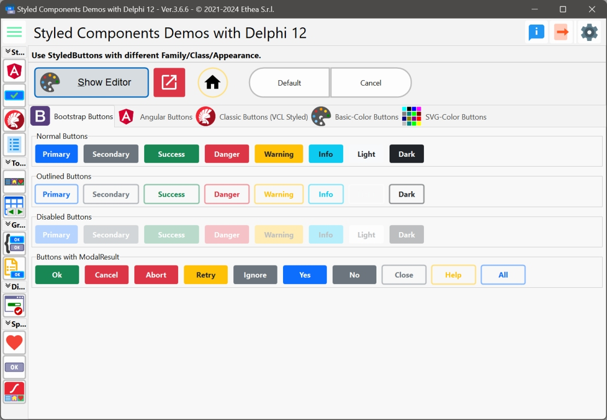
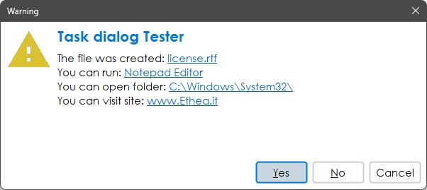

# Delphi StyledComponents 

## Delphi VCL Button with Custom Graphic Styles (eg.Bootstrap, Angular) and advanced, full-customizable TaskDialog, also with animations!

### Actual official "beta" version: 0.9.9

| Component | Description |
| - | - |
|  | **TStyledGraphicButton** is a "pure" Graphic Button with Styles (eg. Bootstrap) with support of ImageList, Action and full configuration of five states: Normal, Hot, Focused, Down and Disabled. You can use it also into a TVirtualList component.|
|  | **TStyledButton** inherits from TStyledGraphicButton and add support for focus and Tabstop to the button.|
|  | **TStyledTaskDialog** is a special "TaskDialog" component with custom Button Captions and Icons. Using a special Form you can show a full customizable Dialog. Using Skia4Delpghi you can show animated dialogs!|

---

## Description of Styled Buttons ##

**TStyledGraphicButton**, **TStyledButton** and **TStyledTaskDialog** are designed to expand Button functionalities.

The Button Styles defined are not affected by VCLStyles and are also visibile on a "non styled" Windows application.

**Component editor for TStyledGraphicButton and StyledButton:**

To simplify use of the Styled Buttons, there is a useful "Component Editor" to select three values that defines Button Style:

- StyleFamily (the pages "Classic", "Bootstrap", "Angular-Light" and "Angular-Dark")

- StyleClass (the buttons)

- Style Appearance (eg.Normal or Outline).

*In this picture, the Component Editor to select "Boostrap" styles: Style Appearance are Normal and Outline*

*In this picture, the Component Editor to select "Angular" styles: Style Appearance are Flat, Raised, Basic, Stroked*

**Look at the Demo Folder:**

**Demos\Delphi10_3+\StyledButtonsDemo**

A simple demo to show the use of Buttons in many different ways...

In the demo you can test many different ways to obtain Styled Button, Icon, FAB...

---

## Description of StyledTaskDialog ##

**TStyledTaskDialog** is designed to expand message/task dialog functionalities, fully customizable and also animation.

**Demos\StyledTaskDlgDemo and Demos\AnimatedTaskDialogDemo**

A simple demo to show how to use StyledTaskDialog with custom icons, caption for buttons, etc.

If you have Skia4Delphi, you can also try the AnimatedTaskDialogDemo, with nice animations.

Activating "Use Styled Dialog" you can use a special form to show complete custom Dialog, like in those pictures:

*Confirmation Dialog with custom font and English buttons*

*Warning Dialog with italians Buttons*

*Error Dialog*

*Custom Dialog*

*Shield Dialog with footer*

**Demos\Delphi10_4+\StyledButtonInControlList**

A simple demo to show how to use StyledGraphicButton into a ControlList (only for D10.4+)

### Available from Delphi XE6 to Delphi 11 (32bit and 64bit platforms)

Related links: [embarcadero.com](https://www.embarcadero.com) - [learndelphi.org](https://learndelphi.org)

### RELEASE NOTES

15 Nov 2022: version 0.9.9
StyledButton:
- Added Angular-Light and Angular-Dark Families
- Radius renamed to StyleRadius
- BorderType renamed to StyleDrawType
- Fixed MouseDown for GraphicButton
- Added CreateAndPosStyledButton global function
- Added AssignAttributes method
- Changed "Down" to "Pressed"
- Changed "Focused" to "Selected"
- Fixed ClickEffect
- Updated Demo
- Updated Component Editor to include Angular Families
StyledDialog:
- Added example of AnimatedTaskDialog using Skia4Delphi
- TStyledTaskDialogForm is the base Form class for any StyledDialog
- Added example of Lottie animations in Animations folder
- Added resources of Animation built with Resource Compiler
- Added Delphi 10.1, 10.2, 10.3 Packages

10 Nov 2022: version 0.9.8
StyledButton:
- Added DisabledImages, DisabledImageName, DisabledImageIndex, PressedImageIndex, PressedImageName, HotImageIndex, HotImageName, SelectedImageIndex, SelectedImageName.
- Used GDI+ for rendering of buttons
- Added Circle and Square Buttons styles
StyledDialog:
- Added Footer area and Text
- Added full support for component TStyledTaskDialog (eg.shield icon)
- Fixed Focused and DefaulButton
- Updated test demo

07 Nov 2022: version 0.9.5 (VCL)
- Added Styled Button properties: StyleFamily, StyleClass and StyleAppearance
- Added "Classic Family" with Styles similar to VCL Styles
- Updated "Bootstrap Family"
- Added Component Editor for Styled Button
- Fixed Dialog Form: focused buttons, all dialog buttons available
- Fixed Styled Button

03 Nov 2022: version 0.9.1 (VCL)
- Added TStyledGraphicButton

01 Nov 2022: version 0.9.0 (VCL)
- First "beta" version

Thanks to Paulo Alvis "PraButtonStyle component" for the inspiration of my StyledButton.