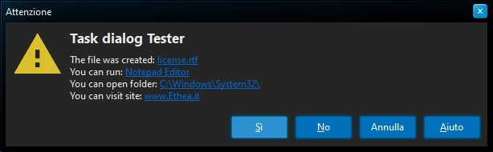
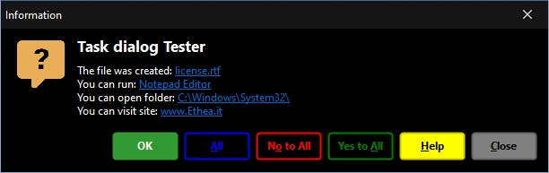

# Delphi StyledComponents 

## Delphi VCL Components (Button and TaskDialog) with Custom Graphic Styles

### Actual official "beta" version: 0.9.5

| Component | Description |
| - | - |
|  | **TStyledGraphicButton** is a "pure" Graphic Button with Styles (eg. Bootstrap) with support of ImageList, Action and full configuration of five states: Normal, Hot, Focused, Down and Disabled. You can use it also into a TVirtualList component.|
|  | **TStyledButton** inherits from TStyledGraphicButton and add supporto for focus and Tabstop to the button.|
|  | **TStyledTaskDialog** is a special "TaskDialog" component with custom Button Captions and Icons. Using a special Form you can show a full customizable Dialog |

## Description ##

**TStyledGraphicButton**, **TStyledButton** and **TStyledTaskDialog** are designed to expand Button and Dialogs functionalities.

The Button Styles defined are not affected by VCLStyles and are also visibile on a "non styled" Windows application.

**Component editor for TStyledGraphicButton and StyledButton:**

To simplify use of the Styled Buttons, there is a useful "Component Editor" to select three values that defines Button Style:

StyleFamily (the pages "Classic" and "Bootstrap"), StyleClass (the buttons) and Style Appearance (eg.Normal or Outline).

**Look at the Demo Folder:**

Notice: to build Demos you must first Download [SvgIconImageList Components](https://github.com/EtheaDev/SVGIconImageList)

**Demos\Delphi10_3+\StyledButtonsDemo**

A simple demo to show different "Styled Class" Buttons (similar to Bootstrap buttons) and outlined versions.

**Demos\StyledTaskDlgDemo**

A simple demo to show how to use StyledTaskDialog with custom icons, caption for buttons, etc.

Activating "Use Styled Dialog" you can use a special form to show complete custom Dialog, like in those pictures:

*Confirmation Dialog*

*Warning Dialog*

*Error Dialog*

*Custom Dialog*

**Demos\Delphi10_4+\StyledButtonInControlList**

A simple demo to show how to use StyledGraphicButton into a ControlList (only for D10.4+)

### Available from Delphi XE6 to Delphi 11 (32bit and 64bit platforms)

Related links: [embarcadero.com](https://www.embarcadero.com) - [learndelphi.org](https://learndelphi.org)

### RELEASE NOTES

07 Nov 2022: version 0.9.5 (VCL)
- Added Styled Button properties: StyleFamily, StyleClass and StyleAppearance
- Added "Classic Family" with Styles similar to VCL Styles
- Updated "Bootstrap Family"
- Added Component Editor for Styled Button
- Fixed Dialog Form: focused buttons, all dialog buttons available
- Fixed Styled Button

03 Nov 2022: version 0.9.1 (VCL)
- Added TStyledGraphicButton

01 Nov 2022: version 0.9.0 (VCL)
- First "beta" version

Thanks to Paulo Alvis "PraButtonStyle component" for the inspiration of StyledButton.